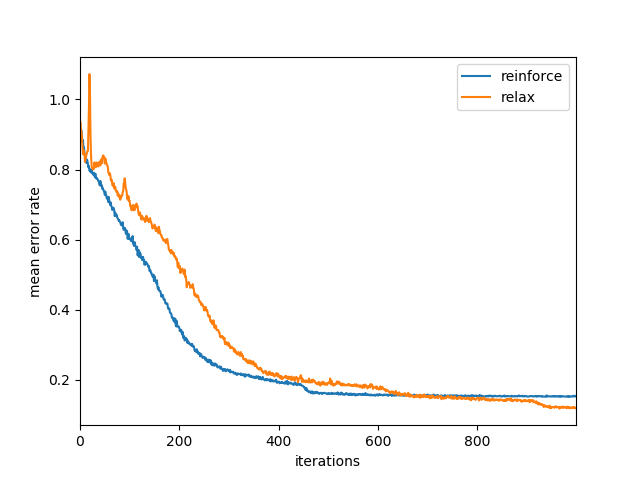

Gradient Estimators
===================

Sometimes we wish to parameterize a discrete probability distribution and
backpropagate through it, and the loss/reward function we use :math:`f: R^D \to
R` is calculated on samples :math:`b \sim logits` instead of directly on the
parameterization `logits`, for example, in reinforcement learning. A reasonable
approach is to marginalize out the sample by optimizing the expectation

.. math::

    L = E_b[f] = \sum_b f(b) Pr(b ; logits)

If that sum is combinatorially infeasible, such as in a reinforcement learning
scenario when one can't enumerate all possible actions, one can use gradient
estimates to get an error signal for `logits`.

The goal of the functions in :mod:`pydrobert.torch.estimators` is to find some
estimate

.. math::

    g \approx \partial E_b[f(b)] / \partial logits

which can be plugged into the "backward" call to logits as a surrogate error
signal.

Different estimators require different arguments. The following are common to
most.

- `logits` is the distribution parameterization. `logits` are supposed to
  represent a parameterization with an unbounded domain.
- `b` is a tensor of samples drawn from the distribution parametrized by
  `logits`
- `dist` specifies the distribution that `logits` parameterizes. Currently,
  there are three.

  1. The value ``"bern"`` corresponds to the Bernoulli
     distribution, which, for parameterizations
     :math:`logits \in R^{A \times B \ldots}` produces samples
     :math:`b \in \{0,1\}^{A \times B \ldots}` whose individual elements
     :math:`b_i` are drawn i.i.d. from :math:`Pr(b_i;logits_i)`. The value
  2. ``"cat"`` corresponds to the Categorical distribution. If the last
     dimension of :math:`logits \in R^{A \times B \times \ldots \times D}`
     is of size :math:`D` and :math:`i` indexes all other dimensions, then
     :math:`b \in [0, D-1]^{A \times B \ldots}` whose individual elements
     are i.i.d. :math:`b_i \sim Pr(b_i = d; logits_{i,d})`
  3. ``"onehot"`` is also Categorical, but
     :math:`b' \in \{0,1\}^{A \times B \times \ldots \times D}` is a one-hot
     representation of the categorical :math:`b` s.t.
     `b'_{i,d} = 1 \Leftrightarrow b_i = d`.

- `fb` is a tensor of the values of :math:`f(b)`. In general, `fb` should be
  the same size as `b`, meaning one evaluation per sample. The exception is
  ``"onehot"``: `fb` should not have the final dimension of `b` as ``b[i, :]``
  corresponds to a single sample

`b` can be sampled by first calling ``z = to_z(logits, dist)``, then
``b = to_b(z, dist)``. Other arguments can be acquired using functions with
similar patterns.

The following is a very simple example of training a neural network using
gradient estimators for Bernoulli samples. We are trying to maximize the
per-sample reward via reward function `f`, which is simply going to reward a 1
and penalize a 0 with some random noise inserted.

>>> import torch
>>> from pydrobert.torch.estimators import *
>>> def f(b):
>>>     return b + torch.randn_like(b)
>>> batch_size, input_size, mc_samples = 31, 11, 100
>>> inp = torch.randn(batch_size, input_size)
>>> ff = torch.nn.Linear(input_size, input_size)

First we'll use the standard REINFORCE estimator [williams1992]_, but `Monte
Carlo <https://en.wikipedia.org/wiki/Monte_Carlo_method>`__ to reduce variance.

>>> optim = torch.optim.Adam(ff.parameters())
>>> optim.zero_grad()
>>> logits = ff(inp)
>>> logits_mc = logits.unsqueeze(0).expand(mc_samples, batch_size, input_size)
>>> z_mc = to_z(logits_mc, 'bern')
>>> b_mc = to_b(z_mc, 'bern')
>>> fb_mc = f(b_mc)
>>> g_mc = reinforce(fb_mc, b_mc, logits_mc, 'bern')
>>> g = g_mc.mean(0)
>>> logits.backward(-g)  # negative b/c we do gradient descent, not ascent
>>> optim.step()

`logits_mc` merely copies the parameterization `logits` `mc_samples` times
along its 0-th dimension, so we're effectively sampling from each categorical
`mc_samples` times. Taking the mean over the gradient estimate's 0-th dimension
will average the estimates across those samples.

Here's how to train the same neural network using the RELAX [grathwohl2017]_
gradient estimator. Here, we're training the control variate `c` by minimizing
the variance of the gradient estimate of `logits`, ``g = g_mc.mean(0)``.

>>> c = torch.nn.Linear(input_size, input_size)
>>> optim = torch.optim.Adam(tuple(ff.parameters()) + tuple(c.parameters()))
>>> optim.zero_grad()
>>> logits = ff(inp)
>>> logits_mc = logits.unsqueeze(0).expand(mc_samples, batch_size, input_size)
>>> z_mc = to_z(logits_mc, 'bern')
>>> b_mc = to_b(z_mc, 'bern')
>>> fb_mc = f(b_mc)
>>> g_mc = relax(fb_mc, b_mc, logits_mc, z_mc, c, 'bern')
>>> g = g_mc.mean(0)
>>> (g ** 2).sum().backward()  # error signal propagates through c
>>> logits.backward(-g)
>>> optim.step()

Last, we'll show how to train an auto-regressive RNN with gradient estimators.
We'll recreate the loss function introduced in [tjandra2018]_, which rewards
new output that reduce the edit distance of the utterance. There are a number
of complexities in the paper that we forego in order to illustrate the role of
the estimator clearly.

Keep in mind that, while there are `num_samps` samples per input, this is not
quite the same as a Markov Estimator. This is because the underlying
parameterization `logits` is dependent upon the sample prefix.

First the prep

>>> import torch
>>> from pydrobert.torch.estimators import *
>>> from pydrobert.torch.util import *
>>> eos, padding = 0, -1
>>> def f(hyp, ref, gamma=.95):
>>>     dists = prefix_error_rates(
>>>         ref, hyp.long(), eos=eos, norm=False, padding=-1)
>>>     r = -(dists[1:] - dists[:-1])
>>>     r = r.masked_fill(dists[1:].eq(padding), 0.)
>>>     R = torch.empty_like(r)
>>>     R[-1] = r[-1]
>>>     for step_idx in range(r.shape[0] - 2, -1, -1):
>>>         R[step_idx] = r[step_idx] + gamma * R[step_idx + 1]
>>>     return R
>>> batch_size, inp_size, num_classes, num_samps = 10, 20, 5, 100
>>> T, S, sos, hidden_size = 30, 10, -1, 40
>>> inp = torch.randn(T, batch_size, inp_size)
>>> ref_lens = torch.randint(1, S + 1, (batch_size,))
>>> ref = torch.nn.utils.rnn.pad_sequence(
>>>     [torch.randint(1, num_classes, (x + 1,)) for x in ref_lens],
>>>     padding_value=padding,
>>> )
>>> ref[ref_lens, range(batch_size)] = eos
>>> # repeat the same reference transcription for each sample
>>> ref_rep = ref.unsqueeze(-1).repeat(1, 1, num_samps)
>>> cell = torch.nn.RNNCell(inp_size + 1, hidden_size)
>>> ff = torch.nn.Linear(hidden_size, num_classes)
>>> c_rnn = torch.nn.RNN(num_classes, hidden_size)
>>> c_ff = torch.nn.Linear(hidden_size, 1)
>>> def c(z):
>>>     mask = z.eq(-float('inf')).any(-1)
>>>     z = z.masked_fill(mask.unsqueeze(-1), 0.)
>>>     z, _ = c_rnn(z)
>>>     z = c_ff(z)
>>>     return z.squeeze(-1)
>>> optim = torch.optim.Adam(
>>>     tuple(cell.parameters()) + tuple(ff.parameters()) +
>>>     tuple(c_rnn.parameters()) + tuple(c_ff.parameters())
>>> )

The following is the training loop: it can be repeated ad-infinitum. Over time,
the printed value will decrease.

>>> h_t = torch.zeros(batch_size, 1, hidden_size)
>>> hyp = torch.full((1, batch_size, 1), sos, dtype=torch.long)
>>> optim.zero_grad()
>>> logits = z = None
>>> for inp_t in inp:
>>>     hyp_tm1 = hyp[-1]
>>>     old_samp = hyp_tm1.shape[-1]
>>>     inp_t = inp_t.unsqueeze(1).expand(batch_size, old_samp, inp_size)
>>>     x_t = torch.cat([inp_t, hyp_tm1.unsqueeze(2).float()], -1)
>>>     h_t = cell(
>>>         x_t.view(batch_size * old_samp, inp_size + 1),
>>>         h_t.view(batch_size * old_samp, hidden_size),
>>>     ).view(batch_size, old_samp, hidden_size)
>>>     logits_t = ff(h_t)  # (batch_size, old_samp, num_classes)
>>>     hyp, z_t = random_walk_advance(
>>>         logits_t, num_samps, hyp, eos, include_relaxation=True)
>>>     if old_samp == 1:
>>>         h_t = h_t.repeat(1, num_samps, 1).contiguous()
>>>         logits = logits_t.unsqueeze(0).expand(-1, -1, num_samps, -1)
>>>         z = z_t.unsqueeze(0)
>>>     else:
>>>         logits = torch.cat([logits, logits_t.unsqueeze(0)], dim=0)
>>>         z = torch.cat([z, z_t.unsqueeze(0)], dim=0)
>>> ref_rep = ref_rep.view(-1, batch_size * num_samps)
>>> hyp = hyp[1:].view(-1, batch_size * num_samps) # get rid of start symbol
>>> logits = logits.view(-1, batch_size * num_samps, num_classes)
>>> z = z.view(-1, batch_size * num_samps, num_classes)
>>> #g = reinforce(f(hyp, ref_rep), hyp, logits, 'cat')  # (1)
>>> g = relax(f(hyp, ref_rep), hyp, logits, z, c, 'cat')  # (2)
>>> logits.backward(-g)
>>> if g.grad_fn is not None:
>>>     (g ** 2).mean().backward()
>>> optim.step()
>>> print(error_rate(ref_rep, hyp, eos=eos).mean())

You can toggle the lines ``(1)`` and ``(2)`` to choose your estimator. Below
shows (some) sample training curves comparing REINFORCE and RELAX. RNG was
fixed.

It took a while for RELAX to converge. This is partly due to the control
variate merely replacing padded `z` values (:math:`-\infty`) with zeros.
However, RELAX did eventually drop below the mean of REINFORCE at around the
700th iteration -- and continues to drop -- whereas REINFORCE plateaued.
